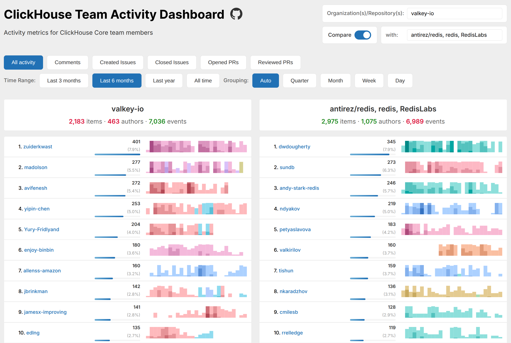

# ClickHouse Team Activity Dashboard

A comprehensive, interactive dashboard for visualizing GitHub activity metrics across organizations and repositories. Built as a single-page application that queries the ClickHouse public dataset of GitHub events.

🔗 **Live Demo:** [Open the dashboard](https://velocity.clickhouse.com/)

## Features

### 📊 Multiple Metrics

Track various types of GitHub activity:
- **All Activity** - Combined view of all contribution types
- **Comments** - Issue and PR comments
- **Created Issues** - New issues opened
- **Closed Issues** - Issues resolved
- **Opened PRs** - Pull requests submitted
- **Reviewed PRs** - Pull requests reviewed and approved

### 🏢 Multi-Organization Support

- Query multiple organizations or repositories simultaneously
- Comma-separated input (e.g., `ClickHouse, apache, google`)
- Full repository names supported (e.g., `apache/spark, google/guava`)
- Combines results with OR logic

### 📅 Flexible Time Ranges

- Last 3 months
- Last 6 months
- Last year
- All time

### 📈 Smart Grouping

- **Auto** - Automatically selects appropriate grouping based on time range
  - 3 months: daily aggregation
  - 6-12 months: weekly aggregation
  - All time: monthly aggregation
- **Quarter** - Quarterly aggregation
- **Month** - Monthly aggregation
- **Week** - Weekly aggregation
- **Day** - Daily aggregation

### 🔄 Comparison Mode

Compare two organizations or repositories side-by-side:
- Unified time ranges for accurate comparison
- Aligned bar widths for visual comparability
- Color-coded statistics (green for higher, red for lower)
- Independent filtering for each side

### 📊 Horizon Charts

Beautiful, space-efficient horizon charts powered by D3.js:
- OKLCH color space for perceptually uniform colors
- Repository-based color coding using cityHash64
- 4-band visualization for activity intensity
- Smooth, responsive rendering

### 🎯 Interactive Features

#### Clickable Elements
- **Login names** - Click to view detailed activity in ClickHouse Playground
- **Data points** - Click chart segments to see activity for that specific time period
- **GitHub profiles** - Hover over logins to reveal GitHub profile links

#### Hover Information
- **Tooltips** - Show exact date and value for each data point
- **Border highlighting** - Visual indication of hovered chart segment
- **GitHub logo** - Appears on login hover for quick profile access

### 🎨 Filtering & Customization

- **Core team only** toggle - Filter to show only core team members (ClickHouse-specific)
  - **With Alexey** sub-toggle - Include/exclude alexey-milovidov
- **Delete logins** - Hide specific users with red × button (shown on hover)
- **Deleted logins tracked in URL** - State persists across sessions

### 📊 Aggregate Statistics

Each organization displays:
- **Unique items** - Total unique issues/PRs (uniq(number))
- **Unique authors** - Total unique contributors (uniq(actor_login))
- **Total events** - Count of all events (count())

Statistics respect all filters (time range, metric, deleted logins, core team mode).

### 🔗 State Management

Complete URL hash-based state persistence:
- Organizations/repositories
- Current metric
- Time range
- Grouping mode
- Toggle states (Core team only, With Alexey)
- Comparison mode and comparison org
- Deleted logins list

Share links with exact dashboard state preserved!

### ⚡ Performance

- Queries the public ClickHouse GitHub events dataset
- Optimized queries with pre-filtering to top 1000 contributors
- Bot account filtering built-in
- Efficient time-based aggregation
- Parallel query execution in comparison mode

## Usage

### Basic Usage

1. Open `index.html` in a web browser
2. Enter organization(s) or repository(s) in the input field
3. Select your desired metric, time range, and grouping
4. View the interactive charts

### Comparison Mode

1. Toggle "Compare" switch
2. Enter second organization/repository in the "with:" field
3. View side-by-side comparison with unified scales

### Exploring Activity

- **Click login names** to see detailed activity in ClickHouse Playground
- **Click chart segments** to see activity for specific time periods
- **Hover over logins** to reveal GitHub profile links
- **Hover over charts** to see exact values

### Sharing

Simply copy the URL - all dashboard state is encoded in the hash fragment and can be shared with others.

## Technical Details

### Stack

- **Frontend:** Pure HTML, CSS, JavaScript (ES6+)
- **Visualization:** D3.js v7
- **Data Source:** ClickHouse public GitHub events dataset
- **API:** ClickHouse Playground REST API

### Color Coding

Charts use the OKLCH color space for perceptually uniform colors:
- Hue determined by `cityHash64(anyHeavy(repo_name))`
- 4 bands with varying lightness (0.85, 0.75, 0.65, 0.55)
- Chroma increases with intensity (0.08, 0.10, 0.12, 0.14)

### Data Processing

1. Queries GitHub events from ClickHouse public dataset
2. Filters to top 1000 contributors by activity
3. Excludes bot accounts via regex pattern
4. Aggregates by actor and time period
5. Processes into horizon chart format

### Query Optimization

- Uses `anyHeavy(repo_name)` for representative repository per time period
- Pre-filters to top contributors to limit dataset size
- Leverages ClickHouse's efficient time functions (`toStartOfDay`, etc.)
- Parallel fetching for comparison mode

## Core Team Members

The dashboard includes a predefined list of ClickHouse core team members for filtering:
- Alexey Milovidov (alexey-milovidov)
- Nikolay Degterinsky (evillique)
- Konstantin Bogdanov (thevar1able)
- ... and more

## License

[Creative Commons Attribution-NonCommercial-ShareAlike 4.0](LICENSE)

## Contributing

Contributions are welcome! The entire application is contained in a single `index.html` file for easy deployment and modification.

## Links

- [ClickHouse](https://clickhouse.com/)
- [ClickHouse GitHub](https://github.com/ClickHouse/ClickHouse)
- [GitHub Repository](https://github.com/ClickHouse/velocity)
